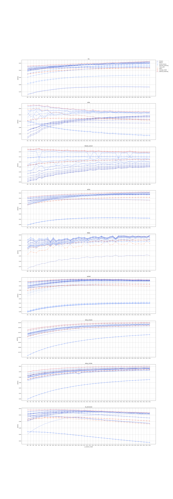

## aaai-claire-clustering

*CLAIRE: Clustering Evaluation based on Model Agreement and Item Response Theory*

## Poetry installation

Run:

```bash
curl -sSL https://install.python-poetry.org | python3 -
```

```bash
pip install poetry
```

## Git clone

Clone this repository:

```bash
git clone https://github.com/{PROPERTY_PROFILE}/aaai-claire-clustering.git
```

next:

```bash
cd aaai-claire-clustering/
```

## Install project dependencies

Run the code bellow for install all dependecies of the project.

```bash
poetry install
```

## Run the pipeline

```bash
poetry run python3 pipeline/run.py
```

## Expected plot of simulation's result



<div class="text-right hide-lg hide-md hide-sm hide-xs flex-self-end ">


